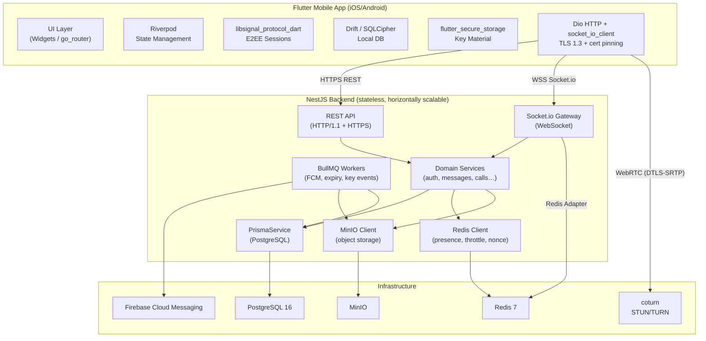
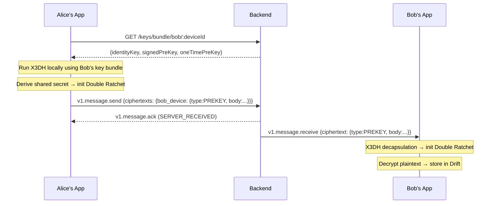
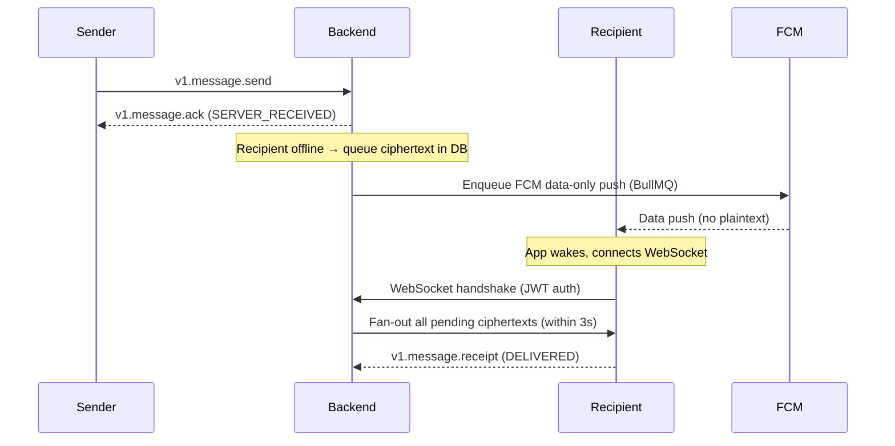
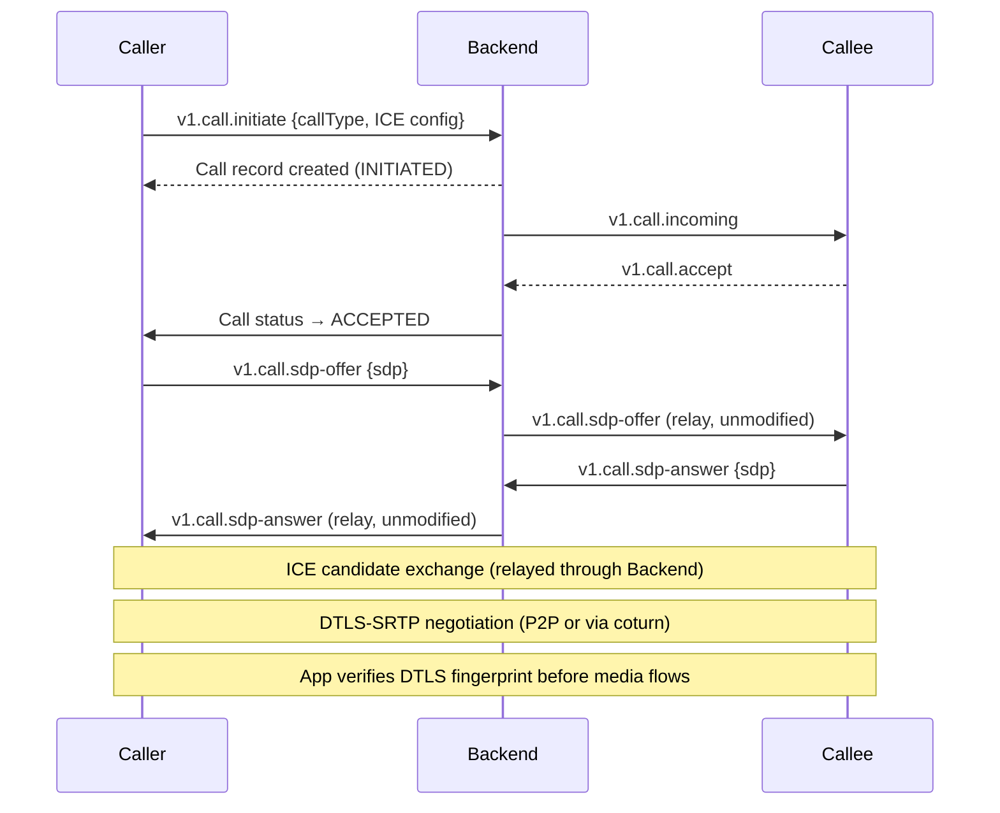
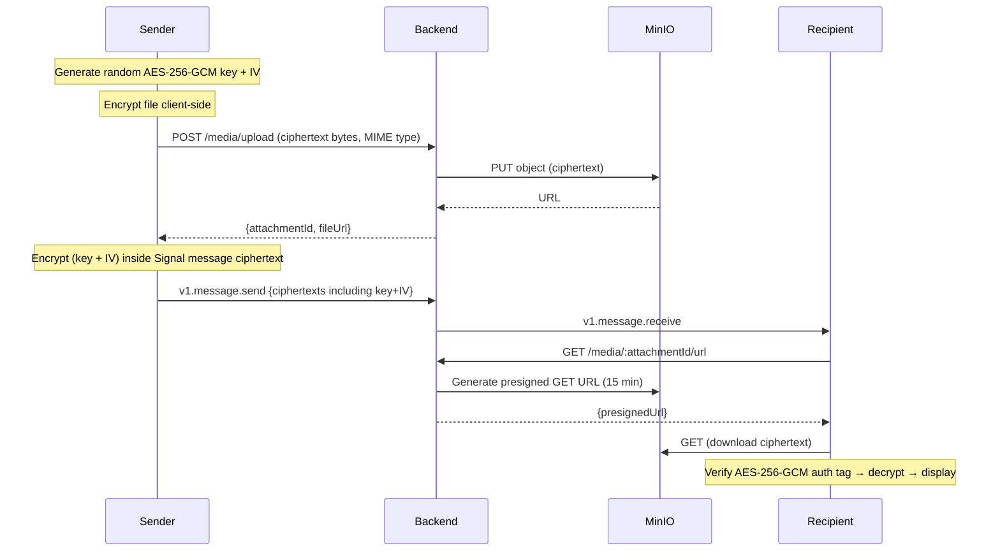

# Design Document: WhatsApp-Style E2EE Chat Application

## Overview

This document describes the technical design for a production-grade, WhatsApp-style end-to-end encrypted messaging and calling application. The system comprises a Flutter mobile client (offline-first, Riverpod state management, Drift/SQLCipher local storage) and a NestJS backend (PostgreSQL via Prisma, Redis, MinIO, BullMQ, Socket.io, coturn WebRTC). All messages and calls are end-to-end encrypted via the Signal Protocol; the backend stores and relays ciphertext only.

The existing backend codebase has modules scaffolded for auth, conversations, messages, calls, keys, media, presence, and metrics. The Prisma schema and initial migration are in place. This design builds on that scaffold to a production-complete implementation.

### Key Design Goals

- **E2EE by default**: Signal Protocol (X3DH + Double Ratchet) for messages; DTLS-SRTP for calls.
- **Offline-first**: Drift/SQLCipher is the source of truth on the client; the backend is a sync/relay layer.
- **Horizontally scalable**: Stateless NestJS instances coordinated by Redis and Socket.io Redis Adapter.
- **Security in depth**: Certificate pinning, argon2id hashing, nonce replay protection, CSRF, security headers.
- **Observability**: OpenTelemetry spans, pino structured logging, Prometheus metrics.

---

## Architecture

### High-Level System Diagram



### Deployment Model

- Multiple stateless NestJS instances behind a load balancer (nginx / AWS ALB).
- Socket.io Redis Adapter (`@socket.io/redis-adapter`) fans out events across instances.
- BullMQ workers run in the same process (or separate worker process) consuming from Redis queues.
- `prisma migrate deploy` runs as a pre-start step in the container entrypoint.

---

## Components and Interfaces

### Backend Modules

#### AuthModule
- **AuthController** – `POST /auth/otp/request`, `POST /auth/otp/verify`, `POST /auth/token/refresh`, `GET /auth/devices`, `DELETE /auth/devices/:deviceId`
- **AuthService** – OTP generation/verification, JWT issuance (15 min), RefreshToken rotation (argon2id hash, 7 days), device management, replay detection.
- **AuthRepository** – Prisma queries for User, Device, RefreshToken.
- **JwtStrategy** – passport-jwt strategy; validates `sub` + `deviceId` on every request.
- **JwtAuthGuard** – applied to all endpoints except OTP routes.

#### KeyModule
- **KeyController** – `POST /keys/upload`, `GET /keys/bundle/:userId/:deviceId`
- **KeyService** – SignedPreKey signature validation (libsignal-client), atomic OneTimePreKey consumption (Prisma `$transaction`), replenishment threshold check, BullMQ job dispatch for replenish/rotate events.
- **KeyRepository** – Prisma queries for IdentityKey, SignedPreKey, OneTimePreKey.

#### ConversationModule
- **ConversationController** – `POST /conversations`, `GET /conversations`, `GET /conversations/:id`, `POST /conversations/:id/members`, `DELETE /conversations/:id/members/:userId`
- **ConversationService** – DIRECT de-duplication (unordered user-pair), GROUP creation, ADMIN/MEMBER role enforcement, soft-delete on empty group, block-pair enforcement, SYSTEM message fan-out.
- **ConversationRepository** – Prisma queries for Conversation, ConversationMember, BlockedUser.

#### MessageModule
- **MessageController** – `GET /conversations/:id/messages` (pagination), `DELETE /messages/:id`
- **MessageGateway** (Socket.io) – `v1.message.send`, `v1.message.receipt`, pending message delivery on reconnect.
- **MessageService** – ciphertext store-and-forward, receipt state machine, fan-out to per-device rooms, offline queuing via Redis, FCM job enqueue.
- **MessageRepository** – Prisma queries for Message, Receipt, Reaction, Attachment.

#### MediaModule
- **MediaController** – `POST /media/upload` (multipart, up to 100 MB), `GET /media/:attachmentId/url`
- **MediaService** – MIME allowlist validation, MinIO presigned PUT (upload) and GET (download, 15 min TTL), AES-256-GCM key/IV storage in Attachment, expiry job scheduling (30-day BullMQ delayed job).

#### CallModule
- **CallGateway** (Socket.io) – `v1.call.initiate`, `v1.call.accept`, `v1.call.decline`, `v1.call.end`, `v1.call.ice-candidate`, `v1.call.sdp-offer`, `v1.call.sdp-answer`
- **CallService** – Call record lifecycle, timeout enforcement (10s for SDP exchange, 30s for unanswered ring), DTLS fingerprint relay (no modification), BUSY detection, missed-call FCM job.

#### PresenceModule
- **PresenceGateway** (Socket.io) – `v1.presence.online`, `v1.presence.offline`, `v1.presence.typing-start`, `v1.presence.typing-stop`
- **PresenceService** – Redis HSET for `user:{id}:presence` (`{online, lastSeenAt}`), typing-stop TTL (5 s), cross-instance broadcast via Redis pub/sub, privacy-visibility filtering.

#### NotificationModule (new)
- **NotificationService** – firebase-admin FCM data-only push, batching (≤5 msgs / 3 s per conversation), missed-call notification, invalid-token cleanup.

#### SecurityModule (new)
- **NonceGuard** – per-request nonce stored in Redis with 5-min TTL; rejects duplicate nonces with HTTP 409.
- **CsrfGuard** – double-submit cookie validation on state-mutating routes.
- **SecurityHeadersMiddleware** – attaches HSTS, X-Content-Type-Options, X-Frame-Options, CSP, Referrer-Policy.

#### ObservabilityModule (new)
- **PrometheusInterceptor** – request count and duration histogram.
- **OtelService** – OpenTelemetry tracer provider, span creation helpers, requestId propagation.
- **PinoLogger** – global pino logger configured to emit JSON; bound to NestJS Logger.

### Flutter Mobile Client Structure

```
apps/mobile/lib/
├── core/
│   ├── db/           # Drift database, DAOs, migrations
│   ├── crypto/       # Signal Protocol session manager, AES-GCM helpers
│   ├── network/      # Dio client (TLS 1.3, cert pinning), socket_io_client
│   ├── security/     # flutter_secure_storage wrapper, root detection
│   └── theme/        # colour tokens, typography, ThemeData
├── features/
│   ├── auth/         # OTP screens, providers, repository
│   ├── conversations/ # list, detail, providers
│   ├── messages/     # chat screen, bubble widgets, providers
│   ├── media/        # upload/download, progress, AES-GCM
│   ├── calls/        # WebRTC, call screen, flutter_webrtc
│   ├── presence/     # typing indicator, online badge
│   ├── reactions/    # emoji picker, reaction bar
│   ├── search/       # local/global Drift search
│   ├── settings/     # privacy, theme, device management
│   └── notifications/ # FCM, flutter_local_notifications
└── shared/
    ├── widgets/       # design system components
    ├── router/        # go_router configuration
    └── contracts/     # Dart mirror of shared-contracts event names
```

### Shared Contracts Package (`packages/shared-contracts`)

Exports:
- `SocketEvent` enum with versioned names (e.g., `v1.message.send`)
- TypeScript interfaces for every socket event payload
- All shared enums: `DeliveryStatus`, `MessageType`, `CallType`, `CallStatus`, `Role`, `ConversationType`
- REST DTO classes (class-validator decorated)

### Socket.io Event Catalog (summary)

| Event name | Direction | Description |
|---|---|---|
| `v1.message.send` | C → S | Send encrypted message |
| `v1.message.receive` | S → C | Deliver ciphertext to recipient device |
| `v1.message.ack` | S → C | SERVER_RECEIVED acknowledgement |
| `v1.message.receipt` | C → S | DELIVERED / READ receipt from recipient |
| `v1.message.receipt.fan-out` | S → C | Receipt update to sender |
| `v1.message.deleted` | S → C | Delete-for-everyone notification |
| `v1.reaction.add` | C → S | Add emoji reaction |
| `v1.reaction.remove` | C → S | Remove emoji reaction |
| `v1.reaction.fan-out` | S → C | Reaction update to all members |
| `v1.presence.online` | C → S | App foregrounded |
| `v1.presence.offline` | C → S | App backgrounded / disconnected |
| `v1.presence.update` | S → C | Presence change for a contact |
| `v1.presence.typing` | C ↔ S | Typing start/stop |
| `v1.call.initiate` | C → S | Initiate call |
| `v1.call.incoming` | S → C | Incoming call to recipient |
| `v1.call.accept` | C → S | Accept call |
| `v1.call.decline` | C → S | Decline call |
| `v1.call.end` | C → S | End call |
| `v1.call.ice-candidate` | C ↔ S | ICE candidate relay |
| `v1.call.sdp-offer` | C → S | WebRTC SDP offer relay |
| `v1.call.sdp-answer` | C → S | WebRTC SDP answer relay |
| `v1.keys.replenish` | S → C | OneTimePreKey pool low |
| `v1.keys.rotate-signed` | S → C | SignedPreKey rotation due |
| `v1.media.expired` | S → C | Media attachment expired |
| `v1.device.force-logout` | S → C | Remote device revocation |

---

## Data Models

### PostgreSQL (Prisma) — Existing Schema

The existing Prisma schema (`apps/backend/prisma/schema.prisma`) defines all required models:

| Model | Key fields | Notes |
|---|---|---|
| `User` | id, phoneNumber, displayName, avatarUrl, about | Phone unique index |
| `Device` | id, userId, deviceId, platform, fcmToken | Unique on (userId, deviceId) |
| `RefreshToken` | id, deviceId, tokenHash, expiresAt | argon2id hash |
| `IdentityKey` | userId, deviceId, publicKey | Unique per device |
| `SignedPreKey` | userId, deviceId, keyId, publicKey, signature | Rotated every 30 days |
| `OneTimePreKey` | userId, deviceId, keyId, publicKey, used | Consumed atomically |
| `Conversation` | id, type, title, avatarUrl | DIRECT or GROUP |
| `ConversationMember` | conversationId, userId, role | Unique per (conversation, user) |
| `Message` | id, conversationId, senderId, type, ciphertexts (JSON), status, replyToId | Indexed (conversationId, createdAt) |
| `Attachment` | messageId, fileUrl, fileName, mimeType, encryptionKey, iv | AES-256-GCM metadata |
| `Receipt` | messageId, userId, deviceId, status | Unique per (message, user, device) |
| `Reaction` | messageId, userId, emoji | Unique per (message, user, emoji) |
| `Call` | id, conversationId, callerId, type, status, startedAt, endedAt | |
| `Participant` | callId, userId, status, joinedAt, leftAt | |
| `BlockedUser` | blockerId, blockedId | Unique pair |
| `Setting` | userId, readReceipts, lastSeenVisibility, profilePhotoVis, theme | One-to-one with User |

**Schema additions needed** (new migration required):

```prisma
// Soft-delete for Conversation
model Conversation {
  // existing fields ...
  deletedAt DateTime?   // soft-delete on last-member-leaves
}

// Nonce store (alternatively kept purely in Redis)
// No additional table; nonces are stored as Redis keys with TTL.

// Setting table needs profilePhotoVis and readReceipts
// Already present in existing schema.
```

### Redis Data Structures

| Key pattern | Type | Purpose | TTL |
|---|---|---|---|
| `user:{userId}:presence` | Hash `{online, lastSeenAt}` | Online status and last-seen | none (updated on events) |
| `user:{userId}:typing:{conversationId}` | String `"1"` | Typing indicator liveness | 5 s |
| `nonce:{nonce}` | String `"1"` | Replay protection | 5 min |
| `otp:{phoneNumber}` | Hash `{code, attempts, lockedUntil}` | OTP lifecycle | 10 min |
| `throttle:otp:{phoneNumber}` | NestJS throttler store | OTP rate-limit | rolling |
| `session:{userId}:sockets` | Set of socket IDs | Active socket tracking per user | none |
| `bullmq:*` | BullMQ internal keys | Job queues | per job |

### Drift (Client-Side) Tables

```dart
// Simplified Drift table definitions

@DataClassName('LocalConversation')
class Conversations extends Table {
  TextColumn get id => text()();
  TextColumn get type => text()();         // DIRECT | GROUP
  TextColumn get title => text().nullable()();
  TextColumn get avatarUrl => text().nullable()();
  DateTimeColumn get lastMessageAt => dateTime().nullable()();
  DateTimeColumn get createdAt => dateTime()();
}

@DataClassName('LocalMessage')
class Messages extends Table {
  TextColumn get id => text()();
  TextColumn get conversationId => text()();
  TextColumn get senderId => text()();
  TextColumn get senderDeviceId => text()();
  TextColumn get type => text()();
  TextColumn get plaintext => text().nullable()();   // decrypted; null until decryption
  TextColumn get status => text()();                 // DeliveryStatus
  TextColumn get replyToId => text().nullable()();
  TextColumn get localStatus => text()();            // QUEUED | SENDING | SENT | FAILED
  DateTimeColumn get createdAt => dateTime()();
}

@DataClassName('LocalAttachment')
class Attachments extends Table {
  TextColumn get id => text()();
  TextColumn get messageId => text()();
  TextColumn get fileUrl => text()();
  TextColumn get fileName => text()();
  IntColumn get fileSize => integer()();
  TextColumn get mimeType => text()();
  TextColumn get encryptionKey => text()();   // base64 AES-256-GCM key
  TextColumn get iv => text()();
  BoolColumn get expired => boolean().withDefault(const Constant(false))();
}

@DataClassName('SignalSession')
class SignalSessions extends Table {
  TextColumn get remoteUserId => text()();
  TextColumn get remoteDeviceId => text()();
  BlobColumn get sessionState => blob()();    // serialised ratchet state
  DateTimeColumn get updatedAt => dateTime()();
}

@DataClassName('LocalUser')
class LocalUsers extends Table {
  TextColumn get id => text()();
  TextColumn get phoneNumber => text()();
  TextColumn get displayName => text().nullable()();
  TextColumn get avatarUrl => text().nullable()();
}
```

### Key Sequence Flows

#### X3DH Session Establishment



#### Offline Message Delivery



#### WebRTC Call Signaling



#### Media Upload/Download



---

## Correctness Properties

*A property is a characteristic or behavior that should hold true across all valid executions of a system — essentially, a formal statement about what the system should do. Properties serve as the bridge between human-readable specifications and machine-verifiable correctness guarantees.*

### Property 1: Signal Protocol Round-Trip Preservation

*For any* plaintext message and any established Signal Protocol session between a sender device and a recipient device, encrypting the plaintext on the sender side and then decrypting the resulting ciphertext on the recipient side SHALL produce a byte-for-byte identical plaintext.

**Validates: Requirements 5.1, 5.2, 5.5**

---

### Property 2: AES-256-GCM Media Round-Trip

*For any* binary file payload, an AES-256-GCM key, and a random IV, encrypting the payload and then decrypting the ciphertext with the same key and IV SHALL produce the original payload; modifying any byte of the ciphertext or the authentication tag SHALL cause decryption to fail with an authentication error.

**Validates: Requirements 8.1, 8.6**

---

### Property 3: DeliveryStatus Forward-Only Progression

*For any* Message, the sequence of DeliveryStatus transitions SHALL form a strictly monotone path through the state machine (QUEUED → SENDING → SERVER_RECEIVED → DELIVERED → READ), and no transition SHALL move the status backward; a status of FAILED MAY occur from SENDING but SHALL NOT revert to any earlier non-FAILED state once READ.

**Validates: Requirements 6.1–6.7, 6.11**

---

### Property 4: Offline Queue Ordering Invariant

*For any* set of messages composed offline in a single conversation, when connectivity is restored the messages SHALL be delivered to the backend in the same creation-order in which they were composed; no message SHALL be delivered out of order relative to messages in the same conversation.

**Validates: Requirements 7.1, 7.2**

---

### Property 5: OneTimePreKey Single-Consumption

*For any* concurrent set of key-bundle requests for the same device, each OneTimePreKey SHALL be returned in at most one bundle; no two concurrent requests SHALL receive the same OneTimePreKey.

**Validates: Requirements 3.9, 3.10**

---

### Property 6: Reaction Upsert Idempotence

*For any* (messageId, userId, emoji) triple, applying a reaction-add event one or more times SHALL result in exactly one Reaction record in the database (the operation is idempotent under repetition); applying a reaction-remove after any number of adds SHALL result in zero Reaction records.

**Validates: Requirements 11.5, 11.6**

---

### Property 7: Presence Visibility Filtering

*For any* requesting user R and profile-owner user P with lastSeenVisibility V, the `lastSeenAt` and `online` fields returned to R SHALL satisfy: if V = EVERYONE, both fields are always present; if V = MY_CONTACTS, both fields are present only if R is in P's contact list; if V = NOBODY, both fields are always absent.

**Validates: Requirements 12.7–12.9, 19.3**

---

### Property 8: Message Deletion Scope Invariant

*For any* message deleted within 30 minutes of sending by the sender, the message SHALL be marked deleted for all recipient devices and the content SHALL be replaced with "This message was deleted" on all devices; for any deletion after 30 minutes, the message SHALL be removed only from the deleting user's local Drift database and all other participants SHALL see the original content unchanged.

**Validates: Requirements 41.1, 41.2, 41.3**

---

### Property 9: Delivery Receipt Fan-Out Completeness

*For any* message M sent in conversation C with N recipient devices, when all N devices have submitted receipts, the sender's device SHALL have received a receipt update event for each of the N devices; no receipt update SHALL be dropped or duplicated in the fan-out path.

**Validates: Requirements 6.4, 6.6, 6.12**

---

### Property 10: DIRECT Conversation De-duplication

*For any* pair of users (A, B), regardless of the order in which the initiation request is submitted (A→B or B→A), the backend SHALL return the same single DIRECT Conversation record and SHALL NOT create a second DIRECT conversation for the same pair.

**Validates: Requirement 4.1**

---

## Error Handling

### Backend Error Strategy

Every error flows through a single `HttpExceptionFilter` and is formatted as:

```json
{
  "success": false,
  "code": "UPPER_SNAKE_CASE",
  "message": "Human-readable description",
  "details": null
}
```

Stack traces and internal details are suppressed when `NODE_ENV !== 'development'`.

| Scenario | HTTP Status | Code |
|---|---|---|
| Invalid / missing DTO field | 400 | `VALIDATION_ERROR` |
| Incorrect OTP | 400 | `INVALID_OTP` |
| OTP brute-force lockout | 429 | `OTP_LOCKED` |
| JWT expired or invalid | 401 | `UNAUTHORIZED` |
| RefreshToken replay | 401 | `TOKEN_REPLAY` |
| Resource not owned by caller | 403 | `FORBIDDEN` |
| Block pair on message send | 403 | `USER_BLOCKED` |
| CSRF token missing or invalid | 403 | `CSRF_VIOLATION` |
| Duplicate nonce | 409 | `REPLAY_DETECTED` |
| Device limit exceeded | 409 | `DEVICE_LIMIT_EXCEEDED` |
| Sole ADMIN leave attempt | 400 | `SOLE_ADMIN_LEAVE` |
| Group member limit exceeded | 400 | `GROUP_MEMBER_LIMIT` |
| Invalid SignedPreKey signature | 422 | `INVALID_KEY_SIGNATURE` |
| File too large | 413 | `PAYLOAD_TOO_LARGE` |
| MIME type not allowed | 415 | `UNSUPPORTED_MEDIA_TYPE` |
| Rate limit exceeded | 429 | `RATE_LIMIT_EXCEEDED` (with `Retry-After` header) |
| Unhandled internal error | 500 | `INTERNAL_SERVER_ERROR` |

### Flutter Client Error Strategy

- Network errors → caught in repository layer, surfaced to Riverpod `AsyncError` state.
- Decryption failures → log at ERROR (no key material), show "Message could not be decrypted" bubble.
- Media auth-tag failure → discard file, show "Attachment could not be verified" error in bubble.
- Offline queue exhausted (500 msgs/conversation) → reject new composition with inline error.
- DB migration failure → block app launch, show "Database upgrade failed" screen.
- Certificate pinning failure → abort connection, show "Connection security error" screen.
- Root detection (if `blockOnRootedDevice = true`) → block all app usage.

### BullMQ Job Error Strategy

- 3 retries with exponential backoff (1s, 2s, 4s).
- Failed jobs move to a dead-letter queue named `{queueName}:failed`.
- All failures logged at ERROR level with job ID, queue name, attempt number, and error message (no sensitive payload data).

---

## Testing Strategy

### Overview

The testing strategy uses a **dual approach**:
- **Unit tests** for specific business logic, edge cases, and error conditions.
- **Property-based tests** for universal correctness properties that must hold across all valid inputs.

### Backend Testing (NestJS / Jest)

**Unit Tests** (`*.spec.ts` co-located with each service):
- All service classes mocked with `@nestjs/testing` + `jest.fn()`.
- Redis and BullMQ are mocked via `jest.mock()` — no external dependencies.
- Target: ≥ 80% line coverage per service file.

**Integration Tests** (`test/*.e2e-spec.ts`):
- Use `supertest` against a real PostgreSQL test database (Docker in CI).
- Test all REST endpoints for correct status codes, response envelopes, and side effects.
- Verify socket event flows using `socket.io-client` in the test process.

**Property-Based Tests** (`*.pbt.spec.ts` alongside unit tests):

Use **fast-check** (TypeScript PBT library) for properties identified in the Correctness Properties section. Minimum 100 runs per property.

| Property | fast-check strategy |
|---|---|
| Property 1: Signal round-trip | Generate arbitrary `Uint8Array` plaintext; run encrypt→decrypt using libsignal-client mock sessions |
| Property 2: AES-256-GCM round-trip | Generate arbitrary `Buffer`; generate random 32-byte key and 12-byte IV; verify encrypt→decrypt identity; verify tag-tamper causes error |
| Property 3: DeliveryStatus forward-only | Generate arbitrary valid status sequences using `fc.constantFrom`; assert no backward transition passes the state machine |
| Property 4: Offline queue ordering | Generate list of messages with random content; feed through offline-queue service; verify output order matches input creation order |
| Property 5: OneTimePreKey single-consumption | Simulate N concurrent bundle requests against a seeded key pool; assert each returned key is unique |
| Property 6: Reaction upsert idempotence | Generate random (messageId, userId, emoji) and N add events; assert exactly one Reaction exists after N adds |
| Property 7: Presence visibility filtering | Generate random (visibilitySetting, isContact) pairs; assert field presence matches the filtering rule |
| Property 8: Message deletion scope | Generate random (deletionTime, messageAge) pairs; assert correct scope (everyone vs self-only) |
| Property 9: Receipt fan-out completeness | Generate N recipient devices; simulate receipt submission from all N; assert sender receives exactly N receipt events |
| Property 10: DIRECT de-duplication | Generate (userA, userB) pairs in both orders; assert same conversation ID returned both times |

Tag format for each test:
```typescript
// Feature: whatsapp-style-chat-app, Property 1: Signal Protocol Round-Trip Preservation
```

### Flutter Testing (Dart / flutter_test)

**Widget Tests**:
- All custom design system components (chat bubble, reaction bar, waveform player, shimmer skeleton, call screen).
- Use `WidgetTester` + `pumpWidget`.

**Provider Unit Tests**:
- All `AsyncNotifierProvider`s tested with `ProviderContainer`.
- Verify loading/data/error states and state transitions on socket events.

**Property-Based Tests**:
- Use **glados** (Dart PBT library) for client-side properties.
- DeliveryStatus state machine transitions (Property 3 from client perspective).
- AES-256-GCM round-trip on client (Property 2).
- Offline queue ordering (Property 4).
- Message deletion scope rule (Property 8).

**Drift Database Tests**:
- Use in-memory `NativeDatabase.memory()` to test DAO queries without device dependency.

### CI Enforcement

| Check | Tool | Threshold |
|---|---|---|
| Backend unit + property tests | Jest | ≥ 80% line coverage per service; < 5 min total |
| Backend integration tests | Jest + supertest | All endpoints green; < 5 min |
| Flutter widget + provider tests | flutter test | All passing; < 10 min |
| TypeScript strict compile | tsc | Zero errors |
| ESLint | eslint | Zero errors |
| Flutter analyze | flutter analyze | Zero warnings |
| Migration governance | CI script | Every migration dir has `rollback.sql` + `migration-notes.md` |
